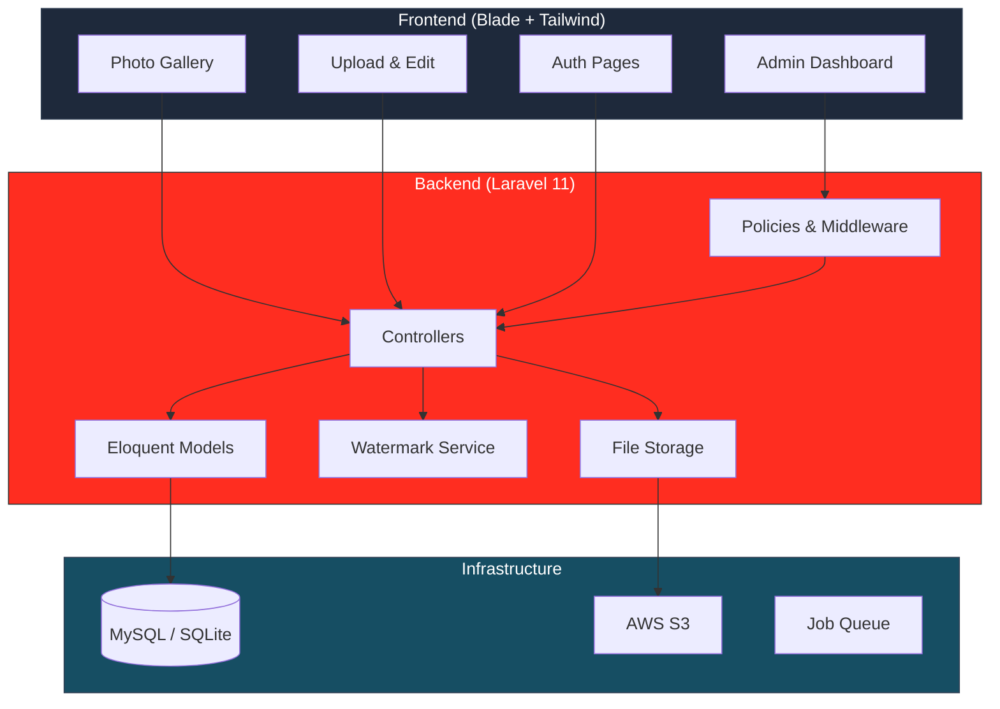

<div align="center">

# PhotoVault

**Full-Stack Photo Gallery with Watermark, Admin Panel & AWS Deployment**

基于 Laravel 11 的全栈相册管理系统

[](https://laravel.com)
[](https://php.net)
[](https://tailwindcss.com)
[](LICENSE)

</div>

---

## Overview

PhotoVault is a full-stack photo management application built with **Laravel 11 + Tailwind CSS**. It provides a complete photo gallery experience with upload, watermark generation, admin management, user authentication, and one-click AWS deployment support.

---

## Architecture



---

## Features

- **Photo Management** — Upload, view, edit, and delete photos with metadata
- **Watermark Engine** — Automatic watermark generation on uploaded images
- **Admin Panel** — Full admin dashboard for user and photo management
- **User Authentication** — Registration, login, email verification (Laravel Breeze)
- **Role-Based Access** — Admin middleware with policy-based authorization
- **AWS Deployment** — Pre-configured deployment scripts for AWS EC2 + S3
- **Responsive UI** — Tailwind CSS dark/light theme with mobile support

---

## Screenshots

<!-- TODO: Add screenshots of the gallery and admin panel -->
> Screenshots coming soon.

---

## Quick Start

### Prerequisites

- PHP 8.2+
- Composer
- Node.js 18+
- MySQL (or SQLite for development)

### Install & Run

```bash
git clone https://github.com/Ei-Ayw/PhotoVault.git
cd PhotoVault

# Install dependencies
composer install
npm install

# Configure environment
cp .env.example .env
php artisan key:generate

# Database setup
php artisan migrate --seed

# Build frontend assets
npm run build

# Start development server
php artisan serve
# Open http://localhost:8000
```

---

## Tech Stack

| Layer | Technology |
|-------|-----------|
| **Backend** | Laravel 11, PHP 8.2 |
| **Frontend** | Blade Templates, Tailwind CSS, Vite |
| **Database** | MySQL / SQLite |
| **Auth** | Laravel Breeze |
| **Storage** | Local / AWS S3 |
| **Testing** | PHPUnit |

---

## License

This project is licensed under the MIT License.

